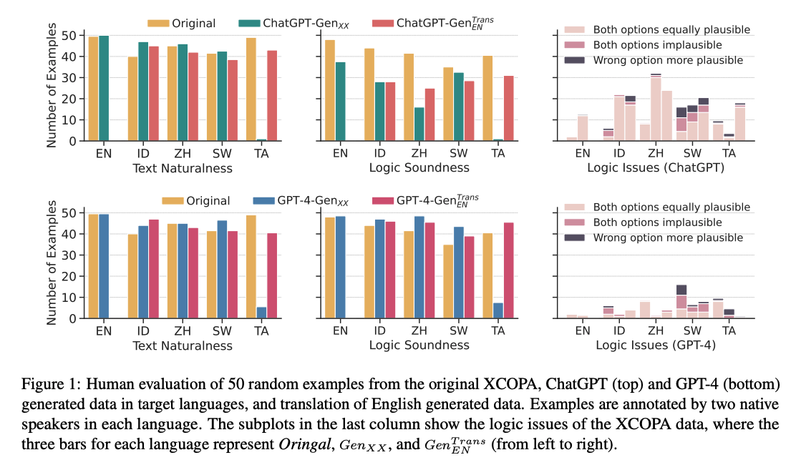

# Gen-X

Resources for our paper, accepted to main conference of EMNLP 2023   :tada:  
<h3>
 LLM-powered Data Augmentation for Enhanced Crosslingual Performance
</h3>

by [Chenxi Whitehouse](https://chenxwh.github.io/),  [Monojit Choudhury](https://www.microsoft.com/en-us/research/people/monojitc/), and [Alham Fikri Aji](https://mbzuai.ac.ae/study/faculty/alham-fikri-aji/)

 

> This paper aims to explore the potential of leveraging Large Language Models (LLMs) for data augmentation in crosslingual commonsense reasoning datasets, where the available training data is extremely limited. To achieve this, we employ several LLMs including Dolly-v2, StableVicuna, ChatGPT, and GPT-4 to augment three datasets: XCOPA, XWinograd, and XStoryCloze.  Subsequently, we assess the effectiveness of fine-tuning smaller crosslingual models, mBERT and XLMR, using the synthesised data.  We compare the performance of training with data generated in English and target languages, as well as translating the English-generated data into the target languages. Our experiments reveal the overall advantages of incorporating data generated by LLMs. Training on synthetic data generated by GPT-4, whether English or multilingual, improves performance consistently compared to the baseline. Other models also exhibit an overall increase in performance, however, their effectiveness decreases in some settings. We also ask native speakers to evaluate the naturalness and logical soundness of the generated examples for different languages. Human evaluation reveals that LLMs like ChatGPT and GPT-4 excel at generating natural text in most languages, except a few such as Tamil. Moreover, ChatGPT trails behind in generating plausible alternatives in comparison to the original dataset, while GPT-4 demonstrates competitive logic consistency in the synthesised data.

 

  

 

 

## Synthesised Dataset

We release GPT-4 generated English Winograd, StoryCloze, and Multilingual XCOPA in `./data`. We note that the non-English XCOPA should be used with caution as some of the langauge may have very poor performance, such as `Tamil`. 

You can also load the datasets directly from HuggingFace:
  - [Multilingual XCOPA](https://huggingface.co/datasets/chenxwh/gen-xcopa)
  - [English Winograd](https://huggingface.co/datasets/chenxwh/gen-winograd)
  - [English StoryCloze](https://huggingface.co/datasets/chenxwh/gen-storycloze)

 

### Citation

    @misc{whitehouse2023llmpowered,
      title={LLM-powered Data Augmentation for Enhanced Crosslingual Performance}, 
      author={Chenxi Whitehouse and Monojit Choudhury and Alham Fikri Aji},
      year={2023},
      eprint={2305.14288},
      archivePrefix={arXiv},
      primaryClass={cs.CL}
}
